# 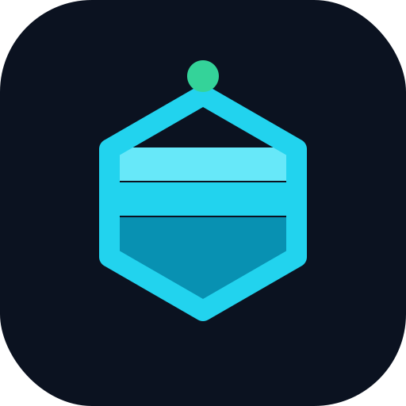 dbtower-lakehouse — 버려지는 관측 데이터의 장기 분석 파이프라인

[](https://github.com/dj258255/dbtower-lakehouse/actions/workflows/ci.yml)

> DBTower가 5기종(MySQL·PostgreSQL·SQL Server·Oracle·MongoDB)에서 수집한 쿼리 스냅샷은
> 메타 DB 포화 방지를 위해 **7일 뒤 삭제된다**(AWS Performance Insights 기본 보존 선례).
> 그런데 "이번 달 vs 지난달 회귀 추세", "분기 용량 계획", "기종별 성능 비교" 같은 질문은
> 장기 이력이 있어야 답할 수 있다. 이 프로젝트는 **만료 직전의 스냅샷을 컬럼나 저장소로
> 내려(ELT) 장기 분석을 가능하게 하는 데이터 파이프라인**이다.

## 한 줄 정체성

**운영계(DBTower, 관제)와 분석계(lakehouse, 장기 이력)를 분리**하고, 그 사이를
일 배치 파이프라인으로 잇는다 — 실무에서 OLTP와 DW를 분리하는 그 구조의 축소판.

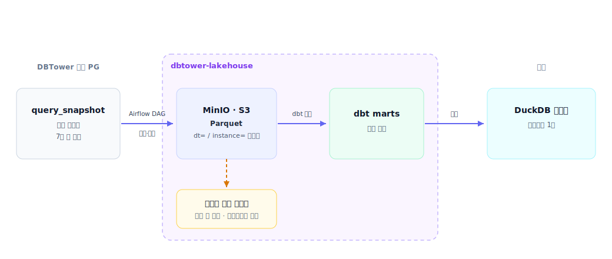

### 파이프라인 흐름

단계 관점으로 접으면 셋 — 추출·적재(EL), 검증·변환(Gate → dbt), 발행·서빙·감시.
각 단에 그 단만의 안전장치(자기파괴 가드, fail-closed 게이트, deadman)가 붙는다.

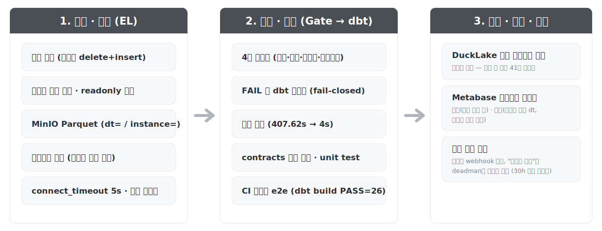

### 상세 아키텍처

위 그림의 상세판 — 컨테이너 경계·포트(15432/19000/8080/13001), 태스크 체인
`offload → quality_gate → transform → publish → heartbeat`, 품질 FAIL 시 webhook 분기,
heartbeat를 역방향으로 감시하는 deadman, 주간 CHECKPOINT까지 한 장에 담았다.

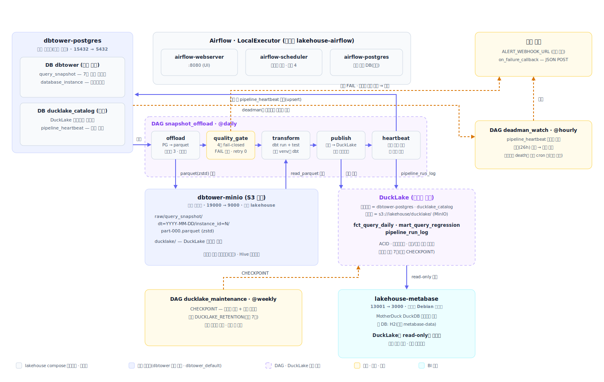

### 데이터 모델

원천 2테이블 → raw parquet(파티션 키) → staging(SUM 정규화) → `fct_query_daily`(일간 델타)
→ `mart_query_regression`(롤링 윈도우)과 운영 테이블(`pipeline_run_log`·`pipeline_heartbeat`)의
실제 컬럼·타입·계보. "누적 → 일간 델타" 변환 지점을 표기했다.

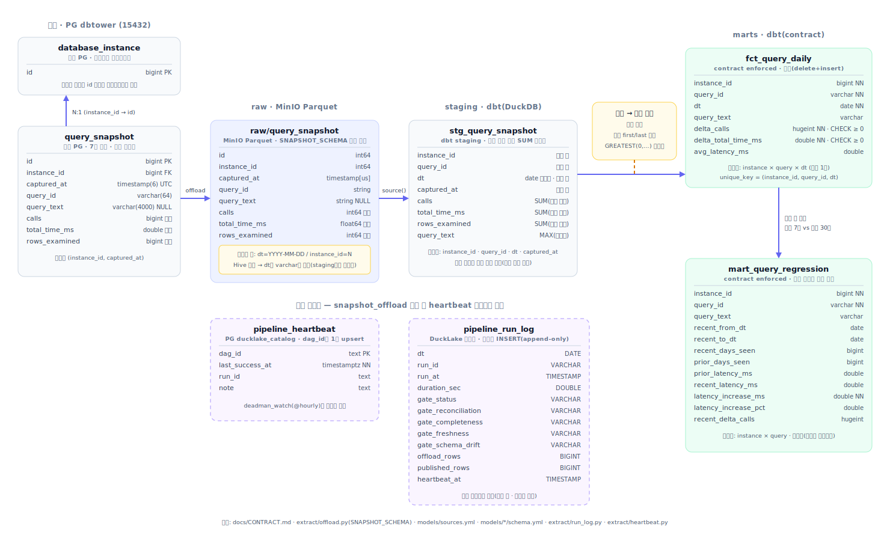

## 실측 화면

Airflow가 `snapshot_offload` DAG를 성공적으로 실행(추출·적재):

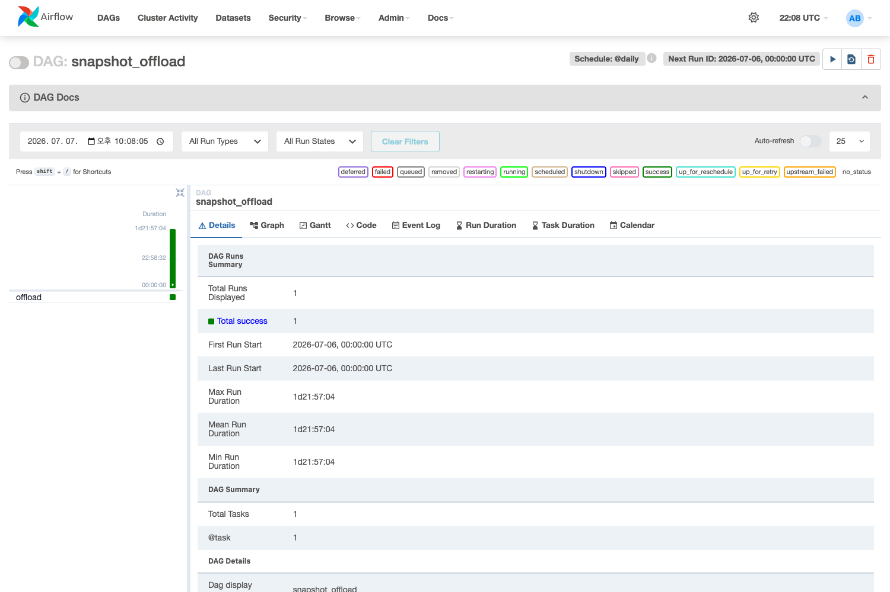

MinIO에 Hive 파티션(dt=/instance=)으로 적재된 Parquet:

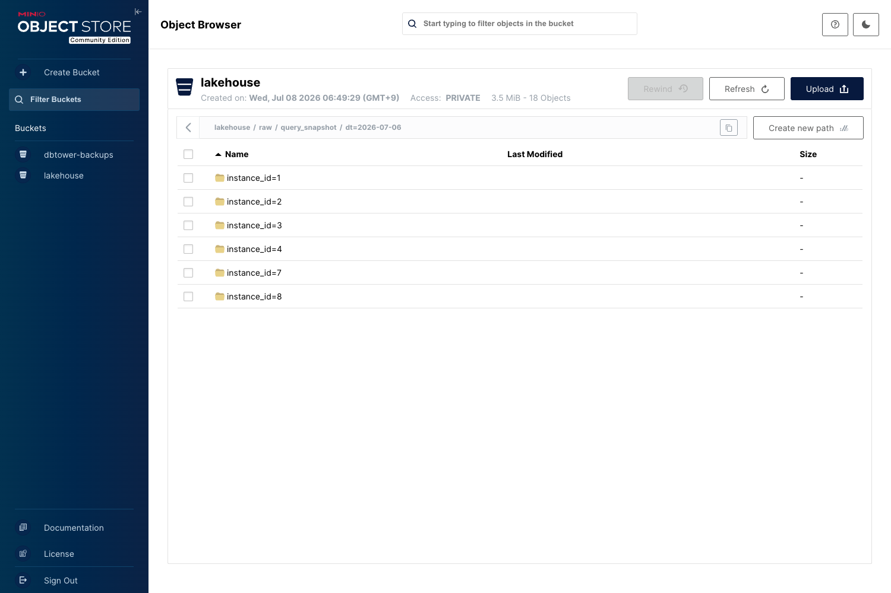

dbt 모델 계보 — raw → staging → marts + 테스트:

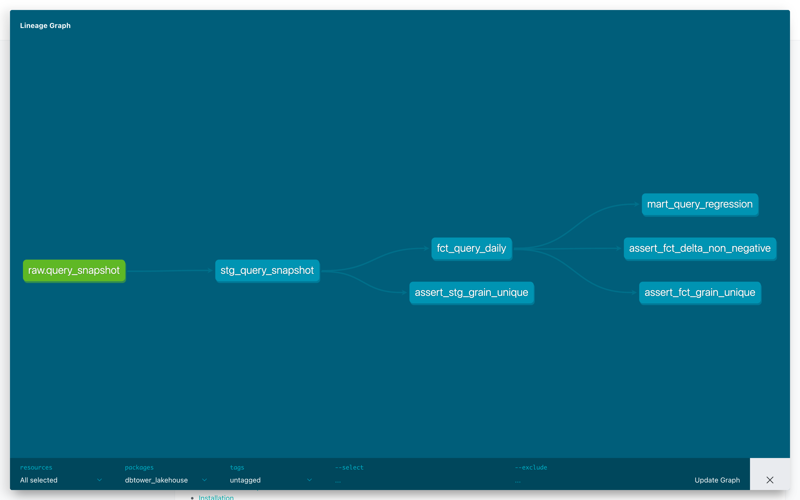

데이터 품질 게이트(fail-closed) — 정상 통과와 장애 주입 시 FAIL로 다운스트림 차단:

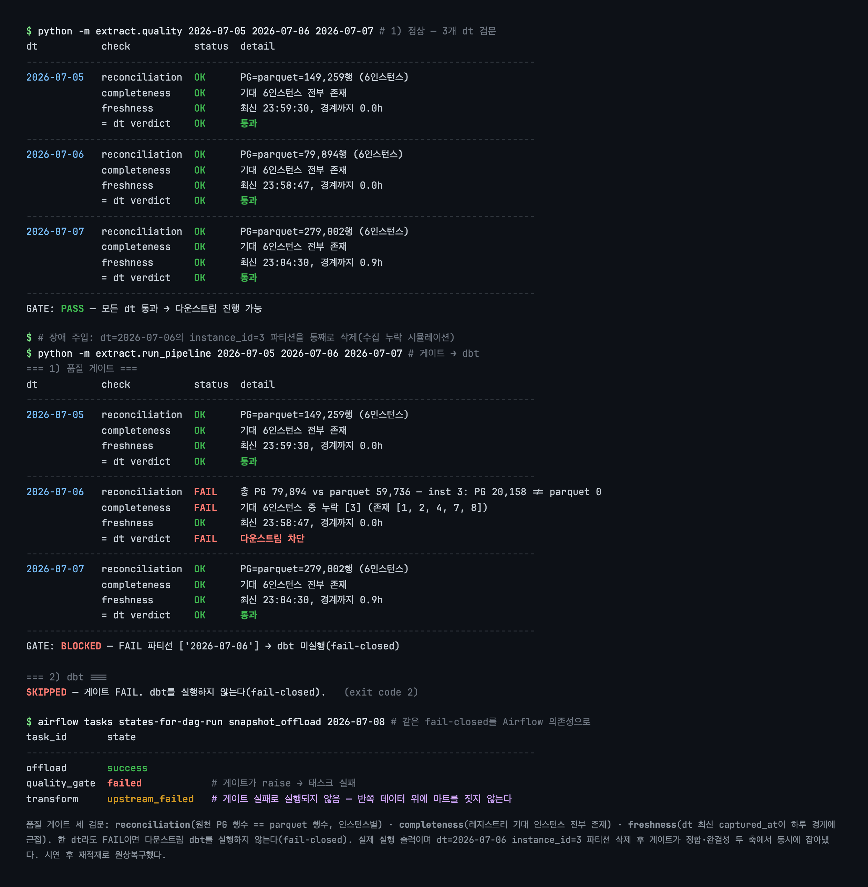

DuckLake 타임트래블 — 과거 버전이 UPDATE 이전 값을 보존, 롤백은 원자적:

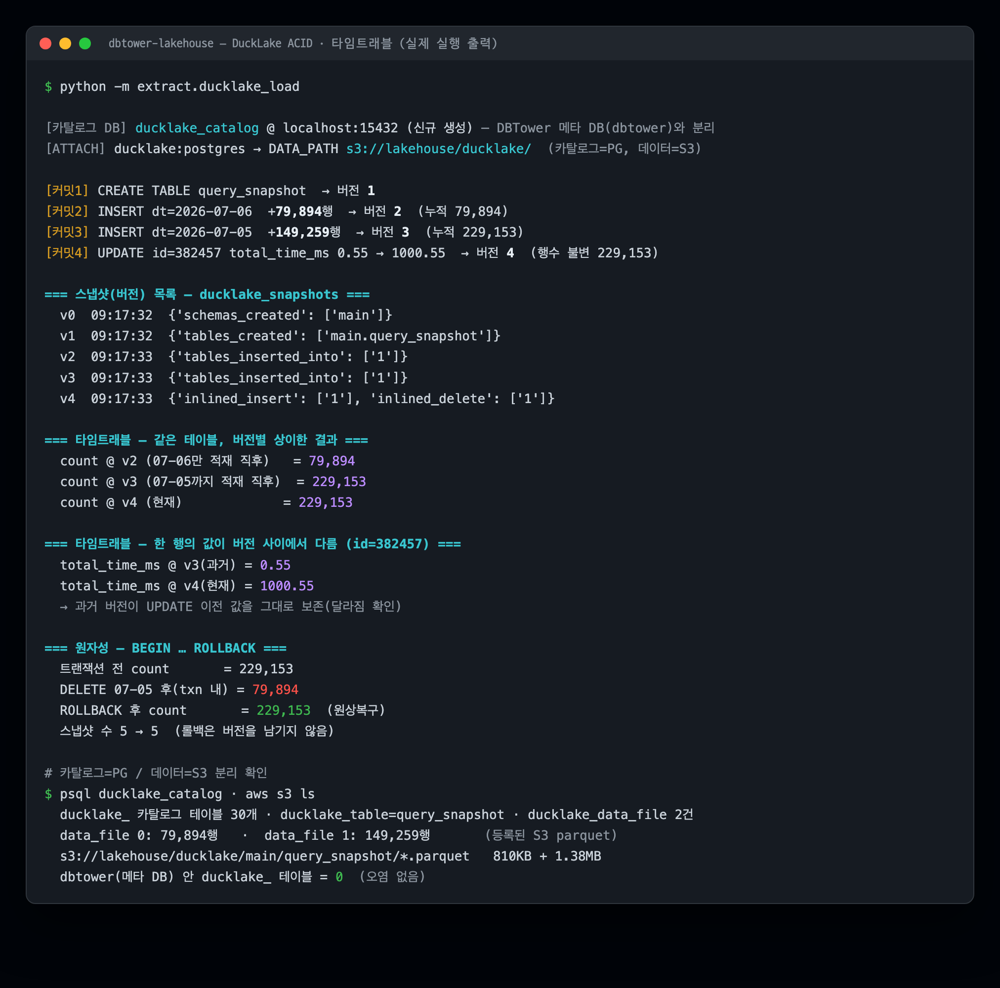

운영 경화(6단계) — offload→quality_gate→transform 3태스크가 전부 컨테이너 안에서
success(dbt run+test 포함), 실패 시 webhook 알림·주간 DuckLake CHECKPOINT·backfill 절차는
[docs/RUNBOOK.md](docs/RUNBOOK.md):

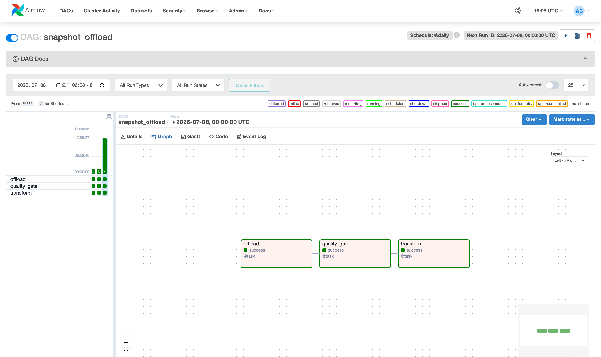

대시보드(7단계) — 0편의 출발 질문 "지난 구간보다 느려진 쿼리 있어?"에 클릭 몇 번으로
답하는 화면. Metabase가 DuckLake(카탈로그=PG, 데이터=S3)를 read-only로 읽고, 마트는
파이프라인 끝의 `publish` 태스크가 매일 발행한다(dbt DuckDB 파일 직결이 안 되는 이유와
실측은 [docs/VERIFICATION.md](docs/VERIFICATION.md) 8절):


원천(DBTower)은 7일이면 지우는 스냅샷인데, 랭킹 표는 구간 양 끝의 평균 지연을 비교해
"instance 8의 g108q7fj4pmkv가 25.89ms → 64.50ms, +149.1%"라고 답한다:


감사 결함 소탕(8단계) — 코드 감사가 잡은 결함 넷을 전/후 실측으로 수정. 핵심은
**아카이브 자기파괴 가드**: 원천 보존(7일) 밖 dt를 backfill/Clear로 재실행하면
delete-first 멱등 덮어쓰기가 유일본 parquet를 지우고 아무것도 안 썼다(실측 재현).
이제 원천 0행 + 파티션 존재 시 삭제 없이 `ArchiveSelfDestructError`로 시끄럽게
실패한다(webhook 경로 탑승). 함께: 게이트의 Seq Scan을 인스턴스별 인덱스 루프로
(EXPLAIN 332ms → 20ms), publish를 단일 트랜잭션으로(중간 실패 시 혼합 버전 대신
롤백), 유지보수 DAG의 데모 테이블 하드 의존 제거, 게이트 4축(스키마 드리프트),
`tests/` 신설(pytest 35개). 전/후 실측은 [docs/VERIFICATION.md](docs/VERIFICATION.md) 9절.

신뢰할 수 있는 파이프라인(9단계) — 커밋마다 검증되고, 스케줄러가 침묵해도 잡히고,
계약을 어기면 빌드가 막힌다. **CI**(GitHub Actions 3관문: ruff·pytest·dbt)가 커밋마다
강제하고, 임베디드 DuckDB라 MinIO·PG 없는 러너에서도 tiny 픽스처로 dbt build를 e2e로
돈다(모델+데이터 테스트+**계약**+**unit test 4건**). **deadman heartbeat**는 성공 시
카탈로그 PG에 생존 신호를 남기고, 기한 내 갱신이 끊기면 역방향으로 경보한다 —
"실패하면 운다"로는 못 잡는 '미실행'(스케줄러 death·DAG pause·원천 침묵)까지 잡는다.
**dbt contracts**는 마트 컬럼 타입·제약을 DB 레벨로 강제해, 컬럼 타입을 바꾸면 발행 전
빌드가 막힌다(위반 주입 → `data type mismatch`로 차단 실측). 전체 실측은
[docs/VERIFICATION.md](docs/VERIFICATION.md) 10절, 운영 절차는 [docs/RUNBOOK.md](docs/RUNBOOK.md) 6절.

규모와 서빙(10단계) — 며칠치로는 "규모에서도 버틴다"를 증명 못 한다. 1년치를
만들어 재보고, 수치가 요구할 때만 최적화했다. 닫힌 dt를 날짜 시프트 복제해 **365dt×
6인스턴스=2,190파일(54.5M행)**을 격리 프리픽스에 합성 적재(실데이터·원천 무접촉,
실측 후 정리)하고 병목을 지목했다 — **fct 전체 재빌드 407.62s가 유일한 병목**이고
나머지(mart 0.31s·게이트 per-dt 8–22ms·CHECKPOINT 0.47s)는 초 단위, 파일은 평균
177KB로 128MB 타깃의 1/741(소파일 폭증 계측). 그 407s가 정당화해 fct를 증분
(delete+insert·컴파일타임 워터마크 프루닝)으로 전환 → **407.62s → 4s(~100배)**.
mart_query_regression은 "전체 이력 첫날 vs 마지막날"에서 **최근 7일 vs 직전 30일
롤링 창**으로 재설계(365dt에서 랭킹 실측). 그리고 매 런 메타를 `pipeline_run_log`로
DuckLake에 발행해 **운영 대시보드**(마지막 성공 dt·오늘 게이트 상태·최근 런)를
분석 대시보드와 이원화했다 — 데이터 없는 07-08을 FAIL로 잡는 화면:


전체 실측(규모 수치표·증분 전/후·롤링 랭킹)은 [docs/VERIFICATION.md](docs/VERIFICATION.md) 11절.

## 스택 (전부 로컬에서 e2e 재현 가능)

| 층 | 도구 | 선택 이유 |
|---|---|---|
| 오케스트레이션 | **Apache Airflow** (docker compose, LocalExecutor) | 업계 표준. 레거시 Oozie와 개념(DAG·스케줄) 동일 |
| 저장 | **MinIO(S3 호환) + Parquet** | DBTower 데모 스택에 이미 있음(재사용). 스토리지/컴퓨트 분리 = lakehouse의 정의 |
| 변환 | **dbt-core + dbt-duckdb** | SQL 기반 변환·테스트·문서화. Hive 가공의 현대판 |
| 테이블 포맷 | **DuckLake** (카탈로그=PostgreSQL, 데이터=parquet) | ACID·타임트래블·스키마 진화 = "lake"를 "lakehouse"로. 이미 PG를 써서 카탈로그 DB 추가 0 (Iceberg는 REST 카탈로그 서버 필요라 로컬엔 과함) |
| 쿼리 엔진 | **DuckDB** | S3 parquet 직독 + DuckLake first-class 지원. 무료·로컬·빠름 |
| 품질 | **자체 4축 게이트(fail-closed) + dbt tests** | 정합·완결성·신선도·스키마 드리프트 검문, FAIL 시 다운스트림 차단 + 웹훅 |
| 테스트 | **pytest** + **dbt unit test** + **CI**(GitHub Actions) | 게이트 판정·자기파괴 가드·발행 원자성·deadman 감시·런 로그 고정(pytest 57개) + 델타·롤링 윈도우 로직 엣지(dbt unit test 5) + **dbt contracts**. ruff·pytest·dbt build를 커밋마다 강제 |
| 대시보드 | **Metabase** (+ MotherDuck DuckDB 드라이버) | 셀프서비스 BI 표준. DuckDB/DuckLake 커넥터가 있어 서빙 DB 추가 0. 대시보드·필터를 API로 재현 가능(scripts/metabase_bootstrap.py) |
| 언어 | **Python 3.12** | DAG·추출 스크립트 |

## 셀프호스트로 띄우기 (어플라이언스)

이 파이프라인은 **DBTower를 셀프호스트하는 사람이 옆에 같이 띄우는 애드온**이다 —
DBTower가 Prometheus면 이건 Thanos다(7일 뒤 사라질 쿼리 스냅샷을 장기 보관·분석).
개발용 `docker-compose.yml`은 내 데모 스택에 얹히지만, `docker-compose.standalone.yml`은
자체 MinIO·카탈로그 PG·Metabase를 번들해 **당신 DBTower 하나만 가리키면** 독립 기동한다.

파이프라인+BI 스택이라 커스텀 이미지가 둘이다 — `dbtower-lakehouse-airflow`(오케스트레이터,
Airflow+dbt 별도 venv+DuckDB)와 `dbtower-lakehouse-metabase`(DuckDB 드라이버 번들 BI). 둘 다
**GHCR에 멀티아치(amd64+arm64)로 게시**되므로, 아래 명령 앞에 한 번 `pull` 하면 빌드 도구 없이
그대로 뜬다(compose 파일만 있으면 됨). 소스에서 직접 빌드하려면 `pull` 대신 `build`.

```bash
# 게시된 이미지 받아 실행 (빌드 없이)
docker compose -f docker-compose.standalone.yml pull
# 소스에서 빌드하려면: docker compose -f docker-compose.standalone.yml build
```

### 데모 (내 DBTower 없이 전체 파이프라인 체험)

```bash
cp .env.standalone.example .env
# 시크릿만 채운다(생성 명령은 .env 주석에). 원천은 비워두면 샘플로 폴백.
docker compose -f docker-compose.standalone.yml --profile demo up -d
```

샘플 원천 PG가 함께 떠서 DBTower 없이도 `offload → 게이트 → dbt → 발행`이 그대로 돈다.

### 프로덕션 (내 DBTower 메타 PG에 연결)

원천 계약은 **두 테이블**이다([docs/CONTRACT.md](docs/CONTRACT.md) §1) — `query_snapshot`(팩트)와
`database_instance`(레지스트리·루프 드라이버). DBTower 메타 PG에 읽기 전용 계정을 만든다:

```sql
CREATE ROLE lakehouse_reader LOGIN PASSWORD '...';
GRANT CONNECT ON DATABASE dbtower TO lakehouse_reader;
GRANT USAGE ON SCHEMA public TO lakehouse_reader;
GRANT SELECT ON query_snapshot, database_instance TO lakehouse_reader;
```

> ⚠️ `database_instance` 권한을 빠뜨리면 인스턴스 0개로 판정돼 **조용히 빈 결과**가 난다
> (셀프호스트 최다 함정). 두 테이블 모두 필요하다.

`.env`의 원천 절(`SRC_PG_*`)을 이 계정으로 채우고 `--profile demo` 없이 기동한다:

```bash
docker compose -f docker-compose.standalone.yml up -d
```

규모(수백~수천 대)면 `.env`의 노브(`AIRFLOW_PARALLELISM`·`DUCKLAKE_RETENTION`)를 올린다
([docs/ROADMAP.md](docs/ROADMAP.md) 12단계). 라이선스는 [LICENSE](LICENSE)(Apache-2.0),
번들 컴포넌트 고지는 [NOTICE](NOTICE).

## 원칙 (DBTower에서 계승)

1. **정직한 필요에서 시작한다** — 도구부터 나열하지 않는다. 모든 단계는 "왜 필요한가"가 먼저다.
   (그래서 Kafka·Spark는 초기 범위에서 뺐다 — 일 수만 행 배치에 스트리밍·분산은 과잉. 잔여로 명시)
2. **실측 필수** — 모든 단계는 로컬 e2e 라이브 실측 + 스크린샷 + `docs/VERIFICATION.md` 절 번호 기록.
3. **부하 원칙** — 추출이 운영계(메타 PG)의 부하가 되면 안 된다. 시간창·LIMIT·읽기 전용.
4. **못 하는 것은 못 한다고** — 근사·표본·미지원은 표기한다.
5. **블로그** — 단계마다 개선 아크(한계 인지 → 판단 → 개선 → 실측 → 잔여)로 기록.

## 관련 저장소

- 데이터 원천: [DBTower](https://github.com/dj258255/dbtower) — 이 파이프라인이 없으면 그 관측 데이터는 7일 뒤 소멸한다.

## 로드맵

[docs/ROADMAP.md](docs/ROADMAP.md) — 완료된 0~10단계 상세(구현 방법·함정·검증 기준·산출물),
다음 아크 11~13단계(셀프호스트 어플라이언스화·인스턴스 수 축 규모 분석·용량 예측 — 미착수·계획),
감사 백로그(완료·다음에 할 것·안 하기로 한 것과 그 이유), dbtower 패밀리 프로젝트 경계.
운영 절차(장애 대응·backfill·유지보수·대시보드)는 [docs/RUNBOOK.md](docs/RUNBOOK.md).
