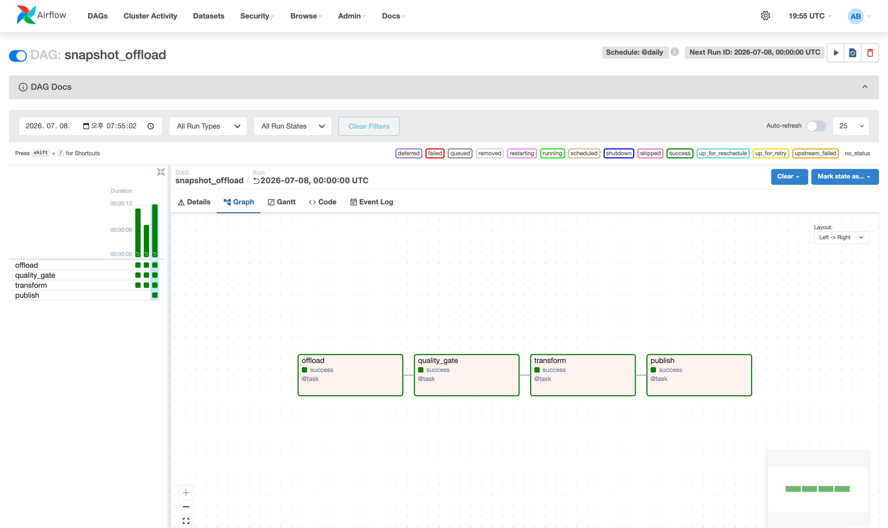
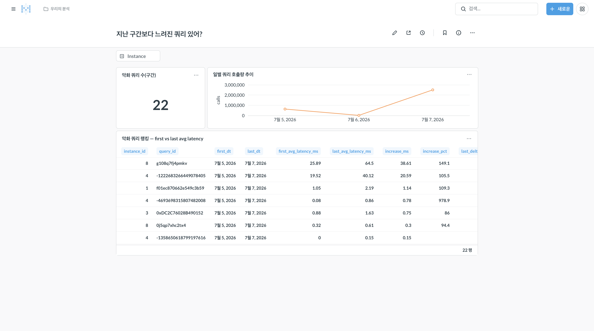
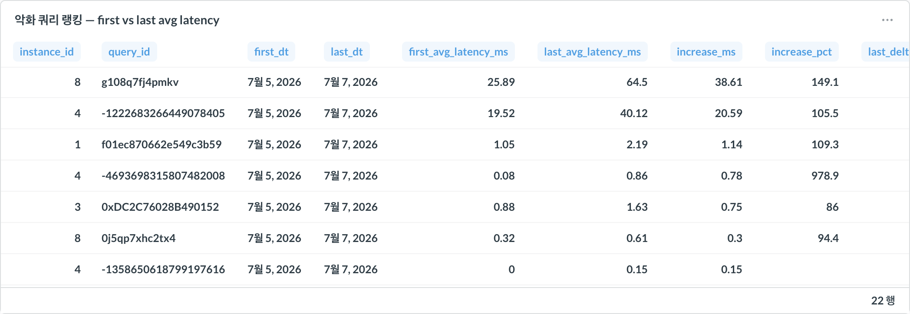
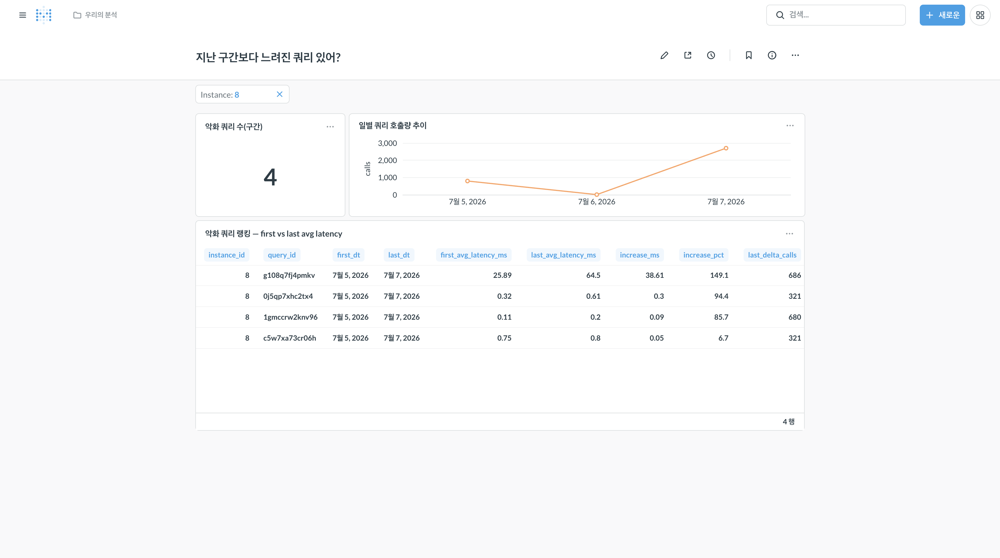
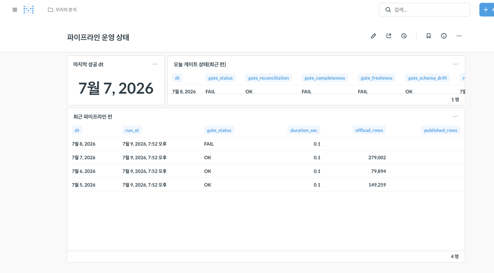

# VERIFICATION — 라이브 실측 기록

> 모든 수치는 실제로 돌린 결과다. 지어낸 것 없음. 재현 명령·원천 대조를 함께 남긴다.
> 실측 환경: macOS, Docker 27.4, Python 3.14(호스트 venv) / Airflow 이미지 python3.12.
> 실측 시각 기준 원천(DBTower)이 라이브로 수집 중이라, "닫힌 UTC 구간"으로 검증한다.

## 1. 0단계 — 스캐폴드 기동

- **원천 확인**: `docker ps`로 `dbtower-postgres`(15432)·`dbtower-minio`(19000) 재사용. MinIO health 200.
- **query_snapshot 존재**: 647,327행, instance 6개(1·2·3·4·7·8), captured_at 2026-07-03~07-07(UTC).
- **Airflow 기동(LocalExecutor)**: `docker compose up -d` →
  `airflow-postgres`(메타, 격리)·`airflow-scheduler`·`airflow-webserver`(:8080) 정상.
  init 컨테이너 exit 0. `airflow dags list-import-errors` → **No data found**(임포트 에러 0).
- **DAG 노출**: `airflow dags list` →
  `snapshot_offload | /opt/airflow/dags/snapshot_offload.py | airflow | True`.
- 스크린샷 자리: Airflow UI 첫 화면(DAG 목록), MinIO 콘솔 로그인(19001).

## 2. 1단계 — Extract & Load e2e

### 2-1. 라이브(진행 중) 구간 dt=2026-07-07

호스트 venv에서 `python -m extract.offload 2026-07-07` 실행.

| instance | 적재 행수 |
|---|---|
| 1 | 38,745 |
| 2 | 66,041 |
| 3 | 40,499 |
| 4 | 73,080 |
| 7 | 2,853 |
| 8 | 47,734 |
| **합계** | **268,952** |

- **원천 대조**(같은 시점 PG count, 동일 UTC 창): **268,952** — 정확히 일치.
- **DuckDB 대조**: `read_parquet('s3://…/dt=2026-07-07/instance_id=*/*.parquet', hive_partitioning=1)`
  count = **268,952** — 원천·적재·조회 3자 일치.
- 스키마 검증(DuckDB DESCRIBE): id BIGINT, instance_id BIGINT, captured_at TIMESTAMP,
  query_id VARCHAR, query_text VARCHAR, calls BIGINT, total_time_ms DOUBLE, rows_examined BIGINT,
  dt DATE(파티션). 선언 스키마와 일치.
- 주의: 07-07은 실측 시점(UTC 07-07 21:5x)에 원천이 라이브 수집 중이라 값이 계속 커진다.
  재실행 시 268,952 → 269,354로 증가한 것은 **원천의 실제 신규 데이터**이지 중복이 아니다
  (오브젝트는 인스턴스당 여전히 1개). 멱등성은 닫힌 구간(2-2)으로 검증한다.

### 2-2. 멱등성 — 닫힌 구간 dt=2026-07-06 (2회 실행)

| 항목 | 값 |
|---|---|
| 원천 PG count | 79,894 |
| offload run A 합계 | 79,894 |
| offload run B 합계(재실행) | **79,894** (불변) |
| 파티션 오브젝트 수 | **6** (인스턴스당 1, 누적 안 됨) |
| DuckDB count | 79,894 |

→ 같은 날짜를 두 번 돌려도 행수·오브젝트 수 불변. whole-partition overwrite 멱등성 확인.

### 2-3. Airflow 스케줄러 e2e — `airflow dags test`

컨테이너 안에서 `airflow dags test snapshot_offload 2026-07-06` 실행:

- 논리 실행일 2026-07-06 → `data_interval_start` = 2026-07-05 → 태스크가 **dt=2026-07-05**를 처리.
  (start_date를 @daily 자정에 정렬해 data interval이 어긋나지 않음을 실증 — "어제" 의미 정확.)
- 결과: `state=success`, 반환값 `total_rows=149,259`.
- **원천 대조** dt=2026-07-05 PG count = **149,259**, **DuckDB** count = **149,259** — 일치.
- 즉 스케줄러가 부른 태스크가 원천→parquet→조회까지 정확히 흘렀다.

스크린샷 자리: Airflow 성공 런(그리드/그래프 뷰), MinIO 콘솔의 파티션 트리, DuckDB count 터미널.

## 3. 부하 원칙 확인

- 원천 세션을 `readonly=True`로 열어 쓰기 자체를 세션 레벨에서 차단.
- instance별 등치 질의(`WHERE instance_id=? AND captured_at>=? AND captured_at<?`)로
  `idx_snapshot_instance_time(instance_id, captured_at)` 선두 컬럼을 탄다(풀스캔 회피).
- 서버커서(named cursor, itersize 50,000)로 결과 전체를 메모리에 올리지 않는다.
- 운영 대상 DB(mysql/oracle 등)에는 접근하지 않음 — 관측 전용 메타 PG에서만 추출.

## 4. 2단계 — dbt 변환 (누적 → 일간 델타)

실측 환경 주의: dbt-core 1.11는 python3.14에서 mashumaro 직렬화 오류로 뜨지 않아,
`.venv`를 python3.12로 재구성해 dbt-duckdb 1.10.1을 설치했다(추출 의존성 동일 재설치).
dbt는 `dbt/dbtower_lakehouse`에서 `--profiles-dir .`로 실행(profiles.yml 동거).

### 4-1. 모델 계층

| 모델 | 물질화 | 역할 |
|---|---|---|
| `stg_query_snapshot` | view | raw parquet 직독 + (instance,query,dt,captured_at) SUM 집계로 지문 충돌·중복 계열을 단일 단조 누적 계열로 접음 |
| `fct_query_daily` | table | (instance,query,dt)별 하루 first-vs-last 차분 + `GREATEST(0,…)` 리셋 클램프 → delta_calls/delta_total_time_ms/avg_latency_ms |
| `mart_query_regression` | table | 첫 활동일 대비 마지막 활동일 평균 지연이 악화된 쿼리 랭킹 |

### 4-2. 핵심 함정 — 누적 카운터 + 지문 충돌 (실측)

- raw를 시간순으로 늘어놓으면 `calls`가 302→55→302→56… 처럼 감소가 섞여 가짜 리셋으로 보인다.
  원인: **(instance_id, query_id, captured_at) 중복 12,743키** — 같은 지문(`query_id`)에 둘 이상의
  누적 계열이 얽혀 있다(예: "SHOW REPLICA STATUS"가 calls=302 계열과 55 계열로 동시 존재,
  같은 query_text·다른 id). id는 전역 PK라 계열 식별자가 못 된다.
- **해법**: staging에서 `captured_at`별로 누적값을 SUM. 단조 비감소 계열들의 합도 단조 비감소이므로
  지문 단위 '총 활동'의 누적 계열이 복원된다.
- **방식 선택**: 하루 first-vs-last(양 끝 차분)를 택함 — DBTower `ComparisonService`의
  `Math.max(0, end.calls - start.calls)`와 동일 원리라 교차검증도 된다. 대안인 '인접 스냅샷 양의 델타
  합산'(Prometheus rate 방식)은 SUM-dedup 뒤 쿼리가 스냅샷 간 사라졌다 재등장할 때 유령 증가분을
  과대계상한다(실측 총 delta_calls 22,264,704 vs first-vs-last 3,126,579). 그래서 first-vs-last 채택.
- **리셋 클램프 동작**: SUM-dedup 후에도 순리셋(하루 last < first) 그레인 **219개** 존재 →
  `GREATEST(0,…)`로 0에 클램프. `fct_query_daily.delta_calls` 최솟값 = **0**(음수 0건).

### 4-3. dbt run / test (실측 로그)

```
$ .venv/bin/dbt run --profiles-dir .
  1 of 3 OK view  main.stg_query_snapshot ...... [OK 0.06s]
  2 of 3 OK table main.fct_query_daily ......... [OK 0.27s]
  3 of 3 OK table main.mart_query_regression ... [OK 0.02s]
  Done. PASS=3 WARN=0 ERROR=0 SKIP=0 TOTAL=3

$ .venv/bin/dbt test --profiles-dir .
  Done. PASS=18 WARN=0 ERROR=0 SKIP=0 TOTAL=18
```

테스트 18개 = not_null 14 + relationships 1(fct.instance_id → stg) + 커스텀 singular 3
(`assert_fct_delta_non_negative` = 누적 델타 ≥ 0, `assert_stg_grain_unique`, `assert_fct_grain_unique`).

### 4-4. 마트가 답한 질문 (실측 결과)

`fct_query_daily` 일자별 요약(min delta_calls = 0 = 클램프 정상):

| dt | 그레인 | 총 delta_calls | 총 delta_time |
|---|---|---|---|
| 2026-07-05 | 534 | 624,915 | 141.2 s |
| 2026-07-06 | 448 | 7,458 | 11.4 s |
| 2026-07-07 | 767 | 2,494,206 | 365.9 s |

`mart_query_regression` 21행. "지난 구간보다 느려진 쿼리?" TOP(07-05 → 07-07 평균 지연):

| inst | 쿼리 | first_ms | last_ms | +ms | +% | last_delta_calls |
|---|---|---|---|---|---|---|
| 8(Oracle) | `SELECT sql_id, MAX(SUBSTR(sql_text…` | 25.89 | 64.50 | 38.61 | 149.1 | 686 |
| 4(메타PG 자기쿼리) | `select qs1_0.id,qs1_0.calls,…` | 19.52 | 38.30 | 18.78 | 96.2 | 1,324 |
| 1(MySQL) | ``SELECT `p`.`ID` AS `pid`,…`` | 1.05 | 2.19 | 1.14 | 109.3 | 416 |

inst 4는 DBTower가 자기 메타 PG에 던지는 스냅샷 적재/조회 쿼리 — 파이프라인이 준 부하를 파이프라인이
관측하는 도그푸딩이 데이터로도 드러난다.

### 4-5. 문서/계보 (스크린샷)

- `dbt docs generate` 후 lineage 그래프: raw.query_snapshot(source) → stg_query_snapshot →
  fct_query_daily → mart_query_regression + 커스텀 테스트 3개 분기.
  `docs/images/dbt-lineage.png`.
- dbt run/test 통과 + 마트 질의 실제 출력: `docs/images/dbt-mart-result.png`.

## 5. 3단계 — 데이터 품질 게이트 (fail-closed)

> 조용히 틀린 데이터는 없는 것보다 나쁘다. raw가 반쪽만 적재됐는데 그 위에 dbt 마트를
> 만들면 "악화 쿼리 랭킹"이 조용히 오답을 낸다. 다운스트림(dbt) 앞에 검문소를 세운다.
> 모듈 `extract/quality.py`, 오케스트레이션 `extract/run_pipeline.py`, DAG는
> `offload → quality_gate → transform`으로 확장.

### 5-1. 세 검문

| 검문 | 판정 규칙 | 실패 시 |
|---|---|---|
| reconciliation | 원천 PG 행수 == parquet 행수(인스턴스별 대조). verify_count 로직 흡수 | FAIL(차단) |
| completeness | 레지스트리(database_instance)의 기대 인스턴스가 그 dt 파티션에 전부 존재 | FAIL(차단) |
| freshness | dt 최신 captured_at이 다음날 00:00에 근접(수집 중단 탐지). 3h 초과 WARN, 12h 초과 FAIL | WARN/FAIL |

fail-closed: 한 dt라도 FAIL이면 `run_pipeline`은 dbt를 아예 호출하지 않고 종료코드 2로 빠진다.
WARN은 통과(경고만). Airflow에선 `quality_gate` 태스크가 예외를 던져 downstream `transform`을 막는다.

### 5-2. 정상 통과 (실측, 3 dt 전부)

```
$ python -m extract.quality 2026-07-05 2026-07-06 2026-07-07
2026-07-05  reconciliation OK  PG=parquet=149,259행 (6인스턴스)
            completeness   OK  기대 6인스턴스 전부 존재
            freshness      OK  최신 23:59:30, 경계까지 0.0h
2026-07-06  ... PG=parquet=79,894행 ... freshness OK 최신 23:58:47
2026-07-07  ... PG=parquet=279,002행 ... freshness OK 최신 23:04:30, 경계까지 0.9h
GATE: PASS — 모든 dt 통과 → 다운스트림 진행 가능   (exit 0)
```

`run_pipeline`으로 이어 붙이면 게이트 통과 후 `dbt run` 실제 실행: PASS=3 WARN=0 ERROR=0.

주의: dt=2026-07-07은 원천 DB의 시계 기준 아직 진행 중인 '오늘'이라(원천 now()가 07-07 23시대)
값이 계속 자란다(268,952 → 269,354 → 279,002). 재적재 직후 그 순간엔 PG=parquet로 맞지만 열린
창이라 다음 순간 또 벌어질 수 있고, freshness가 07-07만 '경계까지 0.9h'로 뜨는 게 그 신호다.
안정 통과 근거는 닫힌 창(07-05·07-06, 149,259·79,894 불변)에 둔다.

### 5-3. 장애 주입 → FAIL로 차단 (실측)

dt=2026-07-06의 `instance_id=3` 파티션(20,158행)을 통째로 삭제(수집 누락 시뮬레이션) 후:

```
$ python -m extract.run_pipeline 2026-07-05 2026-07-06 2026-07-07
2026-07-06  reconciliation FAIL  총 PG 79,894 vs parquet 59,736 — inst 3: PG 20,158 != parquet 0
            completeness   FAIL  기대 6인스턴스 중 누락 [3] (존재 [1, 2, 4, 7, 8])
GATE: BLOCKED — FAIL 파티션 ['2026-07-06'] → dbt 미실행(fail-closed)
=== 2) dbt ===
SKIPPED — 게이트 FAIL. dbt를 실행하지 않는다(fail-closed).   (exit 2)
```

정합·완결성 두 축이 동시에 잡았다. 07-05·07-07은 OK로 통과, 문제 dt만 차단. 시연 후
`python -m extract.offload 2026-07-06`으로 재적재 → 게이트 재통과(PASS) 확인. 리포는 정상 상태.

### 5-4. Airflow — FAIL 시 transform 차단 (실측)

`quality_gate` 태스크에 `retries=0`(품질 FAIL은 결정적이라 재시도 무의미). freshness FAIL 임계를
0.5h로 조여 dt=2026-07-07(경계까지 0.9h)을 강제 FAIL시킨 `airflow dags test` 결과:

```
$ airflow tasks states-for-dag-run snapshot_offload 2026-07-08
offload       success
quality_gate  failed            # 게이트가 raise → 태스크 실패
transform     upstream_failed   # 게이트 실패로 실행되지 않음(반쪽 데이터 위에 마트 안 지음)
```

정상 임계(기본값)로 돌린 `airflow dags test`는 offload·quality_gate·transform 3태스크 전부 success.

- 품질 리포트(정상 OK + 장애주입 FAIL + Airflow 상태): `docs/images/quality-gate.png`.
- Airflow 그래프(offload→quality_gate(빨강 failed)→transform(주황 upstream_failed)): `docs/images/quality-gate-dag.png`.

## 6. 5단계 — DuckLake 테이블 포맷 (lake → house)

> raw는 파티션 parquet를 통째로 덮어쓴다. 정확·멱등하지만 ACID도 타임트래블도 없어
> 엄밀히는 "lake"다. 그 위에 테이블 포맷 DuckLake를 얹는다. **카탈로그는 PostgreSQL**
> (로컬에 이미 PG가 있어 서비스 추가 0, 단 DBTower 메타 DB와 분리된 `ducklake_catalog`),
> **데이터 파일은 MinIO(S3)**. 모듈 `extract/ducklake_load.py`. 재현: `python -m extract.ducklake_load`.
> 수치는 닫힌 UTC 창(07-05·07-06)만 쓴다 — 07-07은 진행 중인 오늘이라 제외.

### 6-1. ATTACH + 카탈로그가 PG에 생성됨 (실측)

```
$ python -m extract.ducklake_load
[카탈로그 DB] ducklake_catalog @ localhost:15432 (신규 생성) — DBTower 메타 DB(dbtower)와 분리
[ATTACH] ducklake:postgres → DATA_PATH s3://lakehouse/ducklake/  (카탈로그=PG, 데이터=S3)
```

- ATTACH: `ATTACH 'ducklake:postgres:dbname=ducklake_catalog ...' AS lh (DATA_PATH 's3://lakehouse/ducklake/')`.
- PG의 `ducklake_catalog` DB에 카탈로그 테이블 **30개**가 생성됨(`ducklake_snapshot`,
  `ducklake_table`, `ducklake_data_file`, `ducklake_schema` 등). 실측:
  `ducklake_table` = query_snapshot 1건, `ducklake_data_file` = 2건(79,894행·149,259행).
- **DBTower 메타 DB(dbtower) 안의 `ducklake_%` 테이블 = 0** — 원천 메타는 오염되지 않음.

### 6-2. 버전이 쌓인다 — 네 번의 커밋 (실측)

| 커밋 | 동작 | 버전 | 누적 행수 |
|---|---|---|---|
| 1 | CREATE TABLE query_snapshot | 1 | 0 |
| 2 | INSERT dt=2026-07-06 (+79,894) | 2 | 79,894 |
| 3 | INSERT dt=2026-07-05 (+149,259) | 3 | 229,153 |
| 4 | UPDATE id=382457 total_time_ms 0.55→1000.55 | 4 | 229,153(불변) |

`ducklake_snapshots('lh')` 목록(실측): v0 schemas_created → v1 tables_created →
v2/v3 tables_inserted_into → v4 inlined_insert+inlined_delete(단일 행 UPDATE는
DuckLake가 parquet 재작성 대신 카탈로그에 인라인). 벌크 INSERT 2건만 S3에 parquet를 썼다.

### 6-3. 타임트래블 — 과거 버전이 현재와 다름을 실제 조회 (실측)

```
count @ v2 (07-06만 적재 직후)  = 79,894
count @ v3 (07-05까지 적재 직후) = 229,153
count @ v4 (현재)             = 229,153
```

한 행 값의 시점 차이(`AT (VERSION => n)`):

```
total_time_ms @ v3(과거) = 0.55       -- UPDATE 이전
total_time_ms @ v4(현재) = 1000.55    -- UPDATE 이후
```

같은 테이블·같은 쿼리인데 버전 지정만으로 과거 상태(행수·행 값)를 그대로 되살렸다.
raw 덮어쓰기로는 불가능했던 것 — 이 지점이 lake가 house가 되는 곳이다.

### 6-4. 원자성 — BEGIN … ROLLBACK (실측)

```
트랜잭션 전 count       = 229,153
DELETE 07-05 후(txn 내) = 79,894
ROLLBACK 후 count       = 229,153   (원상복구)
스냅샷 수 5 → 5  (롤백은 버전을 남기지 않음)
```

트랜잭션 안에서 149,259행을 지워도 ROLLBACK 하면 흔적 없이 되돌아가고, 스냅샷(버전)도
남기지 않는다. 부분 반영이 없다.

### 6-5. 데이터=S3 / 카탈로그=PG 분리 (실측)

```
s3://lakehouse/ducklake/main/query_snapshot/*.parquet
  ducklake-...9163.parquet   810,322 bytes  (79,894행)
  ducklake-...f045.parquet 1,384,993 bytes  (149,259행)
```

카탈로그(메타데이터)는 PG, 실제 컬럼나 데이터는 S3. 스토리지/컴퓨트 분리가 테이블
포맷에서도 유지된다. 증거 이미지: `docs/images/ducklake-timetravel.png`(실제 실행 출력).

## 7. 6단계 — 운영 경화 (알림·retry·컨테이너 e2e·CHECKPOINT·backfill)

> 실측 시점의 원천 시계 = 2026-07-08 17:24 UTC. 즉 **07-07은 이제 닫힌 창**이다
> (dt=07-07 = 279,002행으로 안정 — 이전 세션 마지막 실측치와 동일, 불변 확인).
> 이 절의 수치는 전부 닫힌 창(07-05·07-06·07-07)만 쓴다.

### 7-1. 컨테이너 안 3태스크 e2e — transform이 마침내 DAG 안에서 돈다 (실측)

5단계까지 transform 태스크는 컨테이너에 dbt가 없어 로그만 남기고, 실제 dbt는
호스트 수동 실행이었다(오케스트레이션의 최대 구멍). Dockerfile로 커스텀 이미지를 빌드해
**분리 venv(/opt/dbt-venv)에 dbt-duckdb 1.10.1**을 얹고(Airflow 의존성과 격리),
profiles의 s3 endpoint를 컨테이너 관점(`S3_ENDPOINT_HOSTPORT=dbtower-minio:9000`)으로
주입했다. `airflow dags test snapshot_offload 2026-07-08`(→ dt=2026-07-07) 결과:

```
$ airflow tasks states-for-dag-run snapshot_offload manual__2026-07-08T00:00:00+00:00
offload       success   (dt=2026-07-07, 279,002행 — 원천 PG·parquet 일치)
quality_gate  success   (reconciliation/completeness/freshness 모두 OK, GATE: PASS)
transform     success   (컨테이너 안 dbt run PASS=3 → dbt test PASS=18)

transform 반환값: {'dt': '2026-07-07', 'dbt_run': 'PASS', 'dbt_test': 'PASS'}
DagRun Finished: state=success, data_interval=[2026-07-07, 2026-07-08)
```

dbt run(모델 3) `Done. PASS=3 WARN=0 ERROR=0` + dbt test(18) `Done. PASS=18 WARN=0
ERROR=0` 로그가 태스크 로그 안에 있다 — 처음으로 세 태스크가 전부 한 컨테이너 안에서
끝났다. 스크린샷: `docs/images/e2e-dag.png`(그래프 뷰, 3태스크 success).

### 7-2. 실패 알림 — webhook에 실제로 도착 (실측)

`extract/alerts.py`의 `notify_task_failure`를 두 DAG의 default_args
`on_failure_callback`에 걸었다. URL은 `ALERT_WEBHOOK_URL` env(미설정 시 no-op),
전송 실패는 try/except로 삼켜 파이프라인을 또 죽이지 않는다. SLA 콜백은 쓰지 않았다
(버그 많고 Airflow 3.0에서 제거된 폐기 경로 — on_failure_callback이 2.x 표준).

장애 주입: freshness FAIL 임계를 0.5h로 조여(`QUALITY_FRESHNESS_FAIL_HOURS=0.5`)
dt=07-07(경계까지 0.9h)을 강제 FAIL → 로컬 수신기(`python http.server` 기반, :18808)의
**실제 수신 로그**:

```
[2026-07-08 17:47:22 UTC] POST /alert from 127.0.0.1
{
  "event": "airflow_task_failed",
  "dag_id": "snapshot_offload",
  "task_id": "quality_gate",
  "logical_date": "2026-07-08 00:00:00+00:00",
  "try_number": 1,
  "max_tries": 0,
  "log_url": "http://localhost:8080/dags/snapshot_offload/grid?...&task_id=quality_gate&...tab=logs",
  "error": "품질 게이트 FAIL — 파티션 ['2026-07-07']. 다운스트림 차단."
}
```

같은 순간 스케줄러 로그: `Marking task as FAILED ... task_id=quality_gate` →
`알림 전송 완료 → http://host.docker.internal:18808/alert (HTTP 200)` →
DagRun state=failed(transform 미실행). 차단(4·5절)에 통보가 붙었다.

### 7-3. retry 정책 (default_args)

- 공통: `retries=3`, `retry_delay=2m`, `retry_exponential_backoff=True`(2→4→8분),
  `max_retry_delay=30m` — 원천 재기동·네트워크 순단을 흡수.
- **quality_gate만 `retries=0` 유지** — 품질 FAIL은 결정적이라 재시도해도 그대로 FAIL
  (기존 설계 계승). 위 7-2 수신 payload의 `max_tries: 0`이 그 증거다.
- 부수 경화: 모든 PG DSN에 `connect_timeout=5` — 원천이 죽었을 때 무한 대기 대신
  5초 안에 실패해 재시도·알림 경로에 태운다(실제로 원천 스택 다운 시 무한 대기 사고를
  겪고 넣은 방어).

### 7-4. DuckLake CHECKPOINT — 전/후 실측

DuckLake는 스스로 아무것도 지우지 않는다 — 커밋마다 스냅샷이 쌓이고 덮어쓰인 파일이
남는다. `extract/ducklake_maintenance.py` + `ducklake_maintenance` DAG(@weekly)가
공식 권장 번들 `CHECKPOINT`(만료+플러시+컴팩션 — 만료·컴팩션을 손으로 따로 부르면
순서 이슈가 보고됨) 후 `ducklake_cleanup_old_files`로 삭제 예약 파일을 정리한다.
보존 기간 `DUCKLAKE_RETENTION` 기본 7 days(원천 보존 7일과 대칭), 데모는 0 seconds.

5단계 데모를 2회 반복해 churn을 만든 뒤, 컨테이너 안
`airflow dags test ducklake_maintenance`(DUCKLAKE_RETENTION='0 seconds') 실측:

| 지표 | 전 | 후 |
|---|---|---|
| 스냅샷 수 | 11 | 2 |
| 활성 데이터 파일(카탈로그) | 2 | 2 |
| S3 오브젝트 수 | 7 | 3 |
| S3 바이트 | 7,337,540 | 2,828,889 |
| **테이블 행수(불변식)** | **229,153** | **229,153** |

삭제된 파일 7개, 태스크 state=success. 옛 버전·죽은 파일은 사라지고 현재 상태는
한 행도 안 변했다(모듈이 전/후 행수를 대조해 다르면 예외 — 그 예외도 webhook으로 온다).

### 7-5. backfill 실증 — 멱등이라 행수 불변 (실측)

절차 문서는 `docs/RUNBOOK.md`. 핵심 실측:

- `--dry-run` 선검증: `Dry run of DAG snapshot_offload on 2026-07-06`으로 생성될 런
  확인(TaskFlow XCom 의존 태스크는 렌더 불가로 뒤에서 에러 종료 — 알려진 제약,
  RUNBOOK에 명시).
- `airflow dags backfill snapshot_offload -s 2026-07-06 -e 2026-07-07 --reset-dagruns -y`
  → 런 2개(논리 07-06·07-07 = dt 07-05·07-06 처리), 태스크 6/6 succeeded, failed 0.
  **-s/-e는 논리 실행일(양끝 포함)이고 각 런은 전날 dt를 처리한다** — 실측으로 확정.
- 멱등 검증(전/후 동일):

| 항목 | backfill 전 | backfill 후 |
|---|---|---|
| dt=2026-07-05 행수 | 149,259 | **149,259** |
| dt=2026-07-06 행수 | 79,894 | **79,894** |
| dt=2026-07-06 오브젝트 수 | 6 | **6** |

- `catchup=False`는 유지 — 과거 재처리는 위처럼 명시적으로만. 원천 보존이 7일이라
  backfill 가능 창도 최근 7일이다(그보다 오래된 dt는 원천에 없다).

### 7-6. 재현 가능성

- 이미지: `Dockerfile`(apache/airflow:2.10.4-python3.12 + 추출 의존성 + /opt/dbt-venv에
  dbt-duckdb 1.10.1) — `docker compose build`로 재현. 기동마다 pip을 도는
  `_PIP_ADDITIONAL_REQUIREMENTS`는 폐기(비재현적).
- 알림 배선 점검: `docker exec -w /opt/airflow lakehouse-airflow-scheduler python -m extract.alerts`
  → 수신기에 manual_test payload 도착(HTTP 200)을 실측.

## 8. 7단계 — 대시보드 (Metabase가 DuckLake를 읽는다)

실측 시각 기준 원천 시계 2026-07-08 18:28 UTC, 원천 수집은 07-07 23:04에 멈춰 있어
**dt=2026-07-05·07-06·07-07 전부 닫힌 창**이다(마트 수치 안정). 스크린샷은 전부
실캡처(로그인 후 화면)다.

### 8-1. 드라이버 — 공식 이미지에서 안 뜬다 (실측)

- metabase/metabase:v0.59.16(Alpine/musl) + metabase_duckdb_driver 1.5.3.0:
  드라이버 등록은 되지만 첫 연결에서
  `UnsatisfiedLinkError: libduckdb_java....so: Error loading shared library libstdc++.so.6`
  — DuckDB JDBC 네이티브 라이브러리가 glibc 링크라 musl에서 실패(드라이버 저장소의
  알려진 제약).
- Debian 기반 커스텀 이미지(`metabase/Dockerfile`, eclipse-temurin:21-jre-jammy +
  metabase.jar 0.59.16 + 드라이버 1.5.3.0)로 교체 → 연결 성공. 버전은 짝으로 고정
  (드라이버 1.5.3.0 = Metabase 59 + DuckDB 1.5.3; dbt 쪽 duckdb 1.5.4와 같은 1.5 계열로
  파일·DuckLake 포맷 호환 실측).

### 8-2. 연결 대상 판단 — DuckDB 파일은 서빙 계층 실격 (실측 2건)

**(a) 파일 연결 자체는 된다.** dbt의 DuckDB 파일을 read-only로 물리면 마트가 보이고
수치도 정확하다(8-4와 동일 값). 문제는 읽기가 아니라 **동시성**이다.

**(b) 같은 호스트, 프로세스 2개** — 읽기 전용 커넥션이 물고 있는 파일에 쓰기 열기 시도:

```
Conflicting lock is held in /Library/.../Python (PID 99884) by user beomsu.
```

→ 리눅스 운영이라면 매일 새벽 transform(dbt)이 이 에러로 죽는다. BI는 켜 두는 물건이다.

**(c) 컨테이너 경계(macOS Docker Desktop, virtiofs)** — Metabase 컨테이너가 파일을
물고 있는 상태(`/proc/1/fd/25 → /marts/dbtower_lakehouse.duckdb` 확인)에서 스케줄러
컨테이너의 dbt run: **에러 없이 성공**. 즉 잠금이 컨테이너 경계를 넘어 전파되지 않아,
dbt가 열린 리더 밑에서 파일을 소리 없이 재작성했다. 시끄럽게 죽는 (b)보다 나쁘다 —
쓰기 도중 읽기가 무방비인데 아무도 모른다.

→ **판단**: 마트를 DuckLake(카탈로그=PG, 데이터=S3)로 발행(publish 태스크)하고 Metabase는
DuckLake만 읽는다. 파일 잠금이 아니라 PG 트랜잭션(스냅샷 격리)이 동시성을 중재한다.
드라이버가 duckdb 버전 비호환이었다면 PG로 마트를 내보내는 안이 대안이었는데, 1.5 계열이
맞아서 불필요했다.

### 8-3. e2e — 4태스크 전부 컨테이너 안 success

`airflow dags backfill snapshot_offload -s 2026-07-08 -e 2026-07-08 --reset-dagruns -y`
(→ dt=2026-07-07 처리):

```
offload       success   dt=2026-07-07, 279,002행 (6인스턴스)
quality_gate  success   3검문 OK → GATE: PASS
transform     success   dbt run PASS=3 · dbt test PASS=18
publish       success   fct_query_daily 1,749행 · mart_query_regression 22행 → DuckLake
                        (발행 후 행수를 원본과 대조 — 다르면 예외)
```



### 8-4. 수치 정합 — 마트 = Metabase 화면 (3자 대조)

동일 질의를 (1) dbt DuckDB 파일 직독, (2) Metabase→DuckLake(API /api/dataset),
(3) 대시보드 화면 셋에서 대조:

| 경로 | 악화 1위 | first→last avg latency | 악화율 |
|---|---|---|---|
| DuckDB 파일 직독 | instance 8 · g108q7fj4pmkv | 25.89 → 64.50 ms | **+149.1%** |
| Metabase API(DuckLake) | instance 8 · g108q7fj4pmkv | 25.89 → 64.50 ms | **+149.1%** |
| 대시보드 화면 | instance 8 · g108q7fj4pmkv | 25.89 → 64.50 ms | **+149.1%** |

일별 추이(dt별 delta_calls 합)도 3경로 동일: 07-05=624,915 · 07-06=7,458 ·
07-07=2,503,874. 인스턴스 필터 instance=8 → 악화 쿼리 4행(파일 직독 count와 일치).





### 8-5. 동시성 — 발행(쓰기) 중 대시보드(읽기) 무중단 (실측)

publish(DROP+CREATE 커밋 2회)를 돌리면서 Metabase로 0.3s 간격 연속 질의(41회):
**전부 completed, 매번 온전한 22행** — 커밋과 겹친 읽기(04:05:22~23)도 반쪽 테이블
없이 발행 전/후의 온전한 버전만 봤다(DuckLake 스냅샷 격리). 8-2의 파일과 정반대 결과.

### 8-6. 함정 — 동시 카드 로딩이 SECRET 경합을 깨운다 (실측)

첫 구현은 init_sql에서 `CREATE OR REPLACE SECRET minio(...)`로 S3 자격증명을 만들었다.
카드를 한 장씩 API로 돌리면 전부 completed인데, **대시보드가 카드 3장을 동시에 쏘면**
2장이 500으로 죽었다:

```
TransactionContext Error: Catalog write-write conflict on alter with "minio"
```

커넥션 풀이 커넥션을 여러 개 열고, 커넥션마다 도는 init_sql이 같은 DuckDB 인스턴스의
공유 카탈로그에 SECRET replace를 동시에 시도한 것. 세션 로컬인 `SET s3_*`로 바꾸자
(경합할 공유 상태 자체가 없음) 동시 3카드×3회 반복·콜드 스타트 재기동 후 대시보드
로딩까지 전부 completed.

### 8-7. 재현

- 기동: `docker compose up -d metabase` (metabase/Dockerfile 빌드 포함)
- 초기 설정→연결→질문→대시보드: `.venv/bin/python scripts/metabase_bootstrap.py`
  (멱등 — 전 과정 REST API, 절차는 docs/RUNBOOK.md 5절)

## 9. 8단계 — 감사 결함 소탕 (아카이브가 자신을 지우는 경로)

실측 시점: 2026-07-09. 원천 수집기(DBTower Spring 앱)는 꺼져 있어 원천
max(captured_at)=2026-07-07 23:04 — 닫힌 창(07-05=149,259 / 07-06=79,894)만 수치로 쓴다.

### 9-1. F1 — 아카이브 자기파괴 가드 (전/후 실측)

시나리오: 원천 보존(7일) 밖 dt를 backfill/Clear로 재실행. 원천은 0행, MinIO의
parquet가 유일본. 시연은 실데이터와 무관한 dt=2026-06-01에 가짜 파티션(3행,
2,665바이트)을 심어 재현했다(원천은 읽기 전용 유지 — 시연은 MinIO에서만).

수정 전(HEAD=3dc04a7) — `_delete_prefix()`가 `if table is None: continue`보다 먼저 실행:

```
INFO 기존 파티션 오브젝트 1개 삭제 (raw/query_snapshot/dt=2026-06-01/instance_id=1/)
INFO instance 1: 해당 날짜 데이터 없음 → 스킵
INFO 적재 완료 dt=2026-06-01 총 0행          # exit 0 — '성공'
# after: (dt=2026-06-01 파티션 아래 오브젝트 없음)  ← 유일본 소멸, 복구 불가
```

수정 후 — 원천 0행 + 파티션 존재 시 삭제 없이 예외:

```
ArchiveSelfDestructError: 원천 0행인데 기존 파티션 오브젝트가 존재 — 보존 창 밖
재적재로 판단. 이 파티션이 유일본일 수 있어 삭제를 거부한다(fail-closed). ...
# exit 1 → Airflow 재시도·webhook 알림 경로 탑승
# after: s3://lakehouse/raw/.../part-000.parquet 2665 bytes  ← 유일본 보존
```

원천 0행 + 파티션도 없음 → 스킵+로그(기존과 동일). 원천 N행 → delete→write 멱등 경로
그대로(verify_count 재실행 ALL MATCH — 아래 9-5).

### 9-2. F2 — 게이트의 Seq Scan (EXPLAIN 전/후)

quality._pg_counts·verify_count.pg_count가 captured_at 단독 필터로 원천 전체를 훑었다
— offload가 지킨 인덱스 선두 원칙(instance_id, captured_at)을 게이트 자신이 위반.

```
-- 전: WHERE captured_at >= .. AND < ..  GROUP BY instance_id
Parallel Seq Scan on query_snapshot  (actual time=78.755..318.093 rows=49753 loops=3)
  Rows Removed by Filter: 169683
Buffers: shared hit=15115 read=15962   Execution Time: 332.256 ms

-- 후: WHERE instance_id = %s AND captured_at >= .. AND < ..  (레지스트리 인스턴스별 루프)
Index Only Scan using idx_snapshot_instance_time  (actual time=1.177..18.481 rows=41313)
  Heap Fetches: 0
Buffers: shared hit=5 read=71          Execution Time: 20.213 ms
```

게이트 전체(quality 2일치 4검문) 0.5초. 게이트가 원천에 주던 부하 자체가 검문 대상이었다.

### 9-3. F3 — publish 혼합 버전 (주입 전/후 실측)

수정 전: 마트 2개를 개별 커밋 — 두 번째 CREATE 직전 장애 주입 결과:

```
[주입 전] 최신 스냅샷 v31
[주입 후] 최신 스냅샷 v32
  v32 {'tables_created': ['main.fct_query_daily'], ...}   <- fct만 새로 발행됨
=> 혼합 상태: 대시보드가 "새 fct + 이전 mart"를 본다
```

수정 후(BEGIN…COMMIT 단일 트랜잭션, 실패 시 ROLLBACK): 같은 주입에

```
[주입 후] 최신 스냅샷 v32 (이전 v32)  — 새 스냅샷 0개
=> 원자성 유지: 둘 다 이전 버전(온전한 과거)
```

정상 발행은 스냅샷 하나가 두 테이블을 함께 담는다(v33: tables_created=[mart, fct]).
시연 후 정상 발행으로 원상복구(fct 1,749행 · mart 22행).

### 9-4. F4 — 유지보수 DAG의 데모 테이블 의존 (새 환경 실측)

수정 전 measure()는 데모 산출물 query_snapshot을 하드 참조 — 격리된 새 카탈로그
(ducklake_fresh_demo, 실측 후 폐기)에서 같은 질의가 즉사:

```
CatalogException: Table with name query_snapshot does not exist!
```

수정 후 — 존재하는 테이블 목록(information_schema) 기반으로 측정, 없으면 정리만:

```
스냅샷 수 1 → 1 / 활성 파일 0 / 테이블 (없음 — 정리만 수행)   # 즉사 없음
```

기존 환경에선 마트 포함 3테이블 전부 계측(행수 불변식도 테이블별로).
run_demo의 DROP TABLE도 가드 — 기존 테이블 존재 시 확인 없이는 중단:

```
중단: 기존 query_snapshot(229,153행) 보존. 재생성하려면 --force 또는 DUCKLAKE_DEMO_FORCE=1로 명시할 것.
```

### 9-5. 회귀 없음 + pytest

- `pytest -q` → **35 passed** (게이트 4검문 판정·F1 가드 순수/통합·offload 경계·발행 원자성)
- `verify_count 2026-07-05 2026-07-06` → ALL MATCH (149,259 / 79,894)
- `quality 2026-07-05 2026-07-06` → 4검문(정합·완결성·신선도·스키마 드리프트) 전부 OK, GATE: PASS
- 호스트 run_pipeline(게이트→dbt run) → Completed successfully, PASS=3
- 시연 부산물 전부 정리(가짜 파티션 삭제·scratch 카탈로그 DROP·마트 정상 재발행)

## 10. 9단계 — CI · dbt unit tests · deadman · contracts

실측 시점: 원천 수집기(DBTower Spring 앱)는 07-07 23:04에 멈춰 있어 닫힌 창
(07-05=149,259 / 07-06=79,894)만 수치로 쓴다. CI·unit test·계약 검증은 원천/MinIO/PG
없이 완결되므로(픽스처+임베디드 DuckDB) 원천 상태와 무관하다.

### 10-1. CI 3관문 — 로컬에서 각 단계 직접 실행(act 없이)

`.github/workflows/ci.yml`을 러너가 도는 순서 그대로 호스트에서 재현했다.

```
### ruff ###     All checks passed!
### pytest ###   53 passed
### fixture ###  픽스처 생성: 4개 파티션 파일, 10행 → <tmp>/fixture
                 raw.query_snapshot 뷰 등록 → <tmp>/ci.duckdb
### dbt deps ### (packages.yml 없음 — no-op, exit 0)
### dbt parse ### Performance info: ./target/perf_info.json
### dbt build ### Done. PASS=25 (2 table + 18 data test + 4 unit test + 1 view)  Completed successfully
```

이 스택의 강점이 CI에서 드러난다 — 쿼리 엔진(DuckDB)이 임베디드라, MinIO도 PG도
없는 러너에서 로컬 픽스처 parquet 몇 장(`scripts/ci_fixture.py`)만으로 staging→fct
→mart를 **실제로 짓고** 데이터 테스트·계약·unit test까지 한 번에 돈다. 소스 위치는
`RAW_SNAPSHOT_LOCATION` 환경변수로 픽스처를 가리키게 덮어쓰고(운영 기본값=MinIO s3://
불변), dbt 출력 파일은 `DBT_DUCKDB_FILE`로 임시 파일에 격리한다. 배지는 README.

### 10-2. dbt unit tests — 델타 로직 엣지 4건 (정적 입력 → 기대 출력)

dbt 1.11 + dbt-duckdb 1.10의 unit test로 이 프로젝트의 심장(누적→일간 델타)을 고정.
입력(ref/source)을 목킹하므로 실데이터 없이 로직만 검증한다.

```
fct_query_daily::test_delta_first_vs_last ............ PASS  # 300-100=200, 4000-1000=3000, avg 15.0
fct_query_daily::test_reset_clamps_to_zero ........... PASS  # last(100)<first(500) → GREATEST(0,..)=0, avg NULL
fct_query_daily::test_single_snapshot_day_delta_zero . PASS  # 하루 1스냅샷 → first==last → delta 0
stg_query_snapshot::test_staging_sums_fingerprint_collision  PASS  # 같은 grain 두 계열(120+80) → SUM 200
Done. PASS=4
```

**dbt-duckdb 제약(정직 표기)**: unit test는 입력 relation의 컬럼을 introspect하는데,
외부 `read_parquet` 소스는 물리 relation이 없어 stg의 소스-입력 테스트가
`relation doesn't exist`로 깨진다. 회피는 픽스처 parquet를 가리키는 `raw.query_snapshot`
뷰를 dbt가 쓰는 파일에 미리 등록하는 것(`ci_fixture.py`가 함께 수행) — 여전히 외부 DW·
MinIO·PG는 불필요하다. fct의 unit test는 입력이 모델 ref라 이 문제가 없다.

**라이브 파이프라인과의 분리**: 컨테이너 transform은 `dbt test --select test_type:data`로
데이터 테스트만 돈다. unit test는 목킹 로직이라 라이브 데이터와 결과가 같고(무의미),
외부 소스 introspect도 안 되므로 CI 몫으로 둔다. 실데이터 데이터 테스트는 그대로 PASS=18.

### 10-3. dbt contracts — 계약 위반이 빌드를 막는다 (주입 전/후 실측)

`fct_query_daily`·`mart_query_regression`에 `contract: enforced: true` + 컬럼
name/data_type/constraint 선언. 타입은 실측(DESCRIBE)한 DuckDB 산출 타입 그대로다
(누적 SUM이 HUGEINT로 승격되는 것까지 반영). dbt-duckdb는 constraint를 DB 레벨로
실제 enforce하므로, delta_calls >= 0 클램프 불변식을 CHECK 제약으로 데이터베이스가 강제한다.

정상(실데이터 MinIO 직독, 계약 강제):

```
$ dbt run --profiles-dir . --project-dir .        # RAW_SNAPSHOT_LOCATION 기본값=MinIO
Done. PASS=3 WARN=0 ERROR=0    # 계약이 실데이터 산출 타입과 일치 → 통과
$ dbt test --select test_type:data
Done. PASS=18
```

위반 주입 — 마트 컬럼 하나의 산출 타입을 바꿔(다운스트림 파괴 시뮬레이션):

```
# mart_query_regression.sql: latency_increase_ms 를 CAST(... AS VARCHAR)로 변경
$ dbt build --select mart_query_regression
ERROR creating sql table model main.mart_query_regression
  This model has an enforced contract that failed.
  | column_name         | definition_type | contract_type | mismatch_reason    |
  | latency_increase_ms | VARCHAR         | DOUBLE        | data type mismatch |
Done. PASS=0 ERROR=1
```

계약이 발행 전에 빌드를 막았다 — 대시보드가 기대는 컬럼 타입이 조용히 바뀌는 경로를
CREATE TABLE 시점에 끊는다. 주입을 원복하니 다시 `Completed successfully, PASS=4`.

### 10-4. deadman 알림(heartbeat) — 성공의 부재를 잡는다 (실측)

기존 알림은 "실패하면 운다"뿐이라 태스크가 아예 시작조차 못 하면(스케줄러 death·DAG
pause·원천 침묵) 아무도 안 운다. 성공 시 heartbeat를 카탈로그 PG(ducklake_catalog,
서비스 추가 0)에 남기고, `extract/deadman.py`가 "기한 내 갱신 없으면 경보"하는 역방향
감시다. 경보는 기존 webhook 채널 재사용. 로컬 수신기(:18809)의 **실제 수신 로그**:

```
# 1) 정상 런: heartbeat 기록
[heartbeat] snapshot_offload ← 2026-...  (ducklake_catalog.pipeline_heartbeat upsert)

# 2) deadman(기한 26h) → 방금 찍음 → 건강, 경보 없음
INFO heartbeat 건강 — snapshot_offload: 0.0h 전 성공(기한 26.0h)   exit=0

# 3) 30h 전 성공을 마지막으로 침묵(기한 26h) → 실제 신선도 초과 → 경보 발화, 수신기 HTTP 200
{ "event": "pipeline_deadman", "dag_id": "snapshot_offload",
  "last_success_at": "2026-07-07T16:43:10+00:00", "age_hours": 30.0,
  "deadline_hours": 26.0,
  "error": "heartbeat 정지 30.0h(기한 26.0h 초과) — 스케줄러 death/pause/원천 침묵 의심" }   exit=1

# 4) heartbeat 없는 DAG(미실행/pause 모사) → 경보 발화
{ "event": "pipeline_deadman", "dag_id": "nonexistent_dag", "last_success_at": null,
  "age_hours": null, "error": "heartbeat 없음 — 한 번도 성공 기록이 없다(DAG 미실행/pause 의심)" }   exit=1
```

- 두 실행 경로: (a) Airflow `deadman_watch` DAG(@hourly) — 스케줄러가 사는 동안 pause·
  연속 실패·원천 침묵을 잡는 1차 방어선. (b) 외부 `python -m extract.deadman`(host
  cron/systemd) — Airflow 스케줄러가 통째로 죽는 'total death'까지 잡는다(감시자는
  감시 대상 밖에 있어야 한다). **정직한 한계**: (a)는 자기 스케줄러의 죽음은 못 잡는다.
- 종료코드 = 경보 발화 수(0=건강, 1=경보) — 외부 cron이 비영 종료를 자체 경보로도 태운다.
- 격리 확인: `ducklake_catalog.pipeline_heartbeat`에는 기록이 있고, **DBTower 메타 DB
  (dbtower) 안 pipeline_heartbeat 테이블 수 = 0**(원천 메타 오염 없음 — 5단계부터의 분리 계승).

Airflow 배선: `airflow dags list-import-errors` → No data found, `deadman_watch` 등록,
`snapshot_offload` 태스크에 `heartbeat` 추가(offload→gate→transform→publish→heartbeat),
컨테이너 안 `import extract.heartbeat, extract.deadman` OK.

### 10-5. 회귀 없음 + 테스트 수

- `pytest -q` → **53 passed** (기존 35 + deadman 감시 로직 18: 파싱·신선도 판정 경계·
  run() 발화 페이크). 순수 로직이라 인프라 0.
- 실데이터 `dbt run`(계약 강제) PASS=3 · `dbt test --select test_type:data` PASS=18.
- `verify_count 2026-07-05 2026-07-06` → **ALL MATCH** (149,259 / 79,894 불변).
- `quality 2026-07-05 2026-07-06` → 4검문 전부 OK, GATE: PASS.
- 시연 부산물 정리(임시 픽스처·CI duckdb 삭제, 로컬 수신기 종료, heartbeat는 현재 성공값 유지).

## 11. 10단계 — 규모 실측·증분 전환·롤링 윈도우·운영 대시보드

### 11-1. 365dt 합성 규모 실측 (격리·정리)

닫힌 dt=2026-07-05 parquet(149,259행)를 날짜 시프트 복제해 **365dt × 6인스턴스 =
2,190 파일(54,479,535행, 396.6MB)**을 별도 프리픽스 `s3://lakehouse/scale/`에 생성
(`scripts/scale_synthesize.py`). 실데이터 `raw/`·원천 PG 무접촉. 최근 7일은 쿼리별
악화계수(+50%/+150%)를 주입(롤링 윈도우 검증용). 실측 후 전부 정리(2,196 오브젝트
삭제·`ducklake_scale` 카탈로그 DB drop, 실데이터 raw 508,155행/3dt 불변 확인).

| 단계 | 실데이터(3dt·12파일) | 규모(365dt·2190파일) | 병목 |
|---|---|---|---|
| S3 list_objects_v2 전체 | 12 오브젝트 | 2,190 오브젝트 · **2,182ms** | 글롭 |
| DuckDB 전체 글롭+count | 184ms (508,155행) | **3,471ms** (54,479,535행) | O(이력) |
| **dbt fct 전체 재빌드** | <1s | **407.62s** | **1순위** |
| dbt mart 재빌드 | ~0.3s | **0.31s** | 아니오 |
| 게이트/verify per-dt 글롭 | 8ms | **8–22ms** | 아니오(O(1 파티션)) |
| DuckLake CHECKPOINT(1년 커밋) | — | **0.47s** (366→1파일) | 아니오 |
| Metabase 서빙 카드 응답 | — | **10–60ms**(마트/run_log) | 아니오 |
| 파일 크기 | 평균 177KB | 평균 177KB (min 28KB/max 310KB) | **128MB 타깃의 1/741** |

병목은 **명백히 fct 전체 재빌드(407.62s) 하나**다. 나머지는 규모에서도 초 단위 —
mart는 사전집계라 0.31s, 게이트/verify는 dt별 파티션만 봐서 이력과 무관(8–22ms),
CHECKPOINT는 1년치 366커밋이 쌓은 366 소파일을 1파일로 컴팩션하는 데 0.47s. 파일
크기는 평균 177KB로 실무 합의 타깃(128MB~1GB)의 **1/741** — 소파일 폭증은 있지만
그 고통은 (a) 글롭 리스팅(2.2s)과 (b) DuckLake 커밋 누적으로 나타나고, 후자는
CHECKPOINT가 값싸게 흡수한다(6단계에서 이미 닫음).

### 11-2. 증분 전환 — 수치가 정당화해서 전환 (전/후 실측)

407.62s는 초 단위가 아니다 — 전체 재빌드를 매일 돌리면 이력이 1년일 때 7분이다.
그런데 fct의 grain은 **dt 단위로 완전 독립**(하루 발생량 = 그날 파티션 양 끝 차분,
다른 날과 안 섞임)이라 새 dt만 계산하면 결과가 같다 → 증분 전환이 정당하다.

- dbt-duckdb 1.10.1 지원 전략: `append`·`delete+insert`·(DuckDB 충족 시)`merge`·
  `microbatch`. **microbatch는 event_time 기반이고 unique_key로 파티션 교체를 못
  하는 제약**이 있어, grain이 (instance,query,dt)인 우리엔 `delete+insert` +
  `unique_key`가 정확·단순하다. 새 dt=순수 insert, 같은 dt 재실행=그 dt만 삭제 후
  재삽입(멱등 유지).
- **함정(실측)**: `where dt >= (select max(dt) from {{ this }})` 스칼라 서브쿼리로는
  DuckDB가 hive 파티션 프루닝을 못 해 2,190파일을 전부 스캔했다(증분인데 규모에서
  2분+ 타임아웃). 워터마크를 `run_query`로 **컴파일 타임 리터럴**로 구워 넣자
  파티션 경로 프루닝이 걸려 최신 dt 파일만 읽었다.

| | fct 전체 재빌드 | fct 증분(1 dt 추가) |
|---|---|---|
| 소요(wall) | **407.62s** | **4s** (실작업 ~1–2s + dbt 기동) |
| 읽는 파일 | 2,190 | 워터마크≥ dt만(~6–12) |
| 결과 | 194,910행/365dt | 195,444행/366dt (+534, 멱등 재실행 시 불변) |

약 **100배+**. 과거 dt(<max) 정정은 `--full-refresh` 필요(backfill 레시피 —
RUNBOOK). 실데이터 3dt에서 full-refresh `dbt run` PASS=3 → 증분 재실행 시 1,749행
불변(멱등 확인). 계약(contract)+증분 조합은 `on_schema_change='fail'` 요구(강제).

### 11-3. mart 롤링 윈도우 재설계 (365dt 실측)

기존 `mart_query_regression`은 "전체 이력 첫 활동일 vs 마지막 활동일"이라 이력이
쌓이면 "1년 전 대비 지금"이 되어 README의 "지난달 대비"와 어긋난다. 최신 dt 기준
**최근 recent_days일 vs 직전 prior_days일**(dbt var, 기본 7 vs 30) 롤링 창으로
재설계. 365dt 합성(최근 7일에 +50%/+150% 주입)에서 상위 랭킹:

```
inst query_id        rN pN  prior_ms recent_ms  inc_ms    pct
  8  c5w7xa73cr06     7 30      0.78      1.87    1.08  138.1
  3  0xDC2C76028B     7 30      0.89      1.31    0.42   47.5
  4  -73528926589     7 30      0.49      0.73    0.23   47.5
  8  0j5qp7xhc2tx     7 30      0.32      0.47    0.15   47.5
  ...
pct 분포:  +47.5% 8건 · +138.1% 6건
```

recent_days_seen=7·prior_days_seen=30 정확. 주입한 두 악화 계층이 랭킹으로 분리돼
뜬다. 정확히 +50/+150이 아닌 +47.5/+138.1인 이유: 주입 경계(06-30~)와 롤링 창
경계(직전 30일)가 하루 겹쳐 직전 창 평균에 boosted 하루가 섞였다 — 롤링 평균이
그걸 정직하게 반영한 결과(창을 지어내지 않았다). dbt unit test
`test_rolling_window_recent_vs_prior`로 로직 고정(최근>직전만·양 창 관측 필수·
저콜 제외). **실데이터 3dt에선 mart 0행** — recent 7일이 3dt를 다 삼키고 직전
30일이 비어 비교 불가. 이력 부족을 지어내지 않고 정직하게 빈다(규모에서만 답이 난다).

### 11-4. 운영 대시보드화 (pipeline_run_log → Metabase)

publish/heartbeat가 매 런 메타(dt·게이트 4축·소요·offload/published 행수·heartbeat)를
DuckLake `pipeline_run_log`로 발행(`extract/run_log.py`). 마트와 같은 카탈로그라
Metabase가 기존 DuckLake 커넥션으로 읽는다(서비스·커넥션 추가 0). 실데이터 닫힌
dt로 실측 발행:

| dt | gate | recon | compl | fresh | offload_rows |
|---|---|---|---|---|---|
| 2026-07-05 | OK | OK | OK | OK | 149,259 |
| 2026-07-06 | OK | OK | OK | OK | 79,894 |
| 2026-07-07 | OK | OK | OK | OK | 279,002 |
| 2026-07-08 | **FAIL** | OK | **FAIL** | **FAIL** | (없음) |

07-08(수집기 정지로 데이터 없는 날)은 completeness·freshness FAIL — 게이트가 실제로
잡는 나쁜 날. Metabase 운영 대시보드 "파이프라인 운영 상태"(카드 3장: 마지막 성공
dt=2026-07-07 · 오늘 게이트 상태=07-08 FAIL · 최근 런 표):



분석 대시보드(악화 쿼리)와 운영 대시보드(파이프라인 건강)를 **이원화** — 알림(실패)·
heartbeat(성공의 부재)에 더한 세 번째 축(지금 상태의 화면). alerts payload엔 이미
`dashboard_url` 필드가 있어(8단계) 알림에서 이 화면으로 한 클릭.

### 11-5. 회귀 없음 + 테스트 수

- `pytest -q` → **57 passed**(기존 53 + run_log 레코드 로직 4). 순수 로직이라 인프라 0.
- dbt build(CI 픽스처) **PASS=26**(unit test 5: 기존 4 + 롤링 윈도우 1 · 계약 · 데이터
  테스트 포함). 실데이터 full-refresh `dbt run` PASS=3 · `dbt test test_type:data` PASS=18.
- `verify_count 2026-07-05 2026-07-06` → **ALL MATCH**(149,259/79,894 불변) · 게이트 PASS.
- **합성 데이터 정리 완료**: scale/ 2,196오브젝트 삭제 · ducklake_scale drop · 실데이터
  raw 508,155행/3dt·서빙 마트(fct 1,749·mart 롤링) 원상. Metabase 서빙 카드 10–60ms.

## 12. 잔여 (정직)

- 원천이 라이브라 "완전히 닫힌 최신 구간"은 하루 뒤에야 안정. 실측 시점 기준 07-08이 열린 창이다.
- 지문 충돌은 SUM 집계로 접었지만, 이는 서로 다른 물리 쿼리를 하나로 합치는 근사다. id로 계열을
  완벽히 분리하진 못한다(id는 스냅샷마다 새로 발번). 지문 단위 '총 활동'까지가 정직한 한계.
- first-vs-last는 하루 중 리셋 이후 재상승분을 일부 잃는다(순리셋 219그레인). DBTower 정식 로직과의
  정합을 우선해 감수했고, 잃는 양은 클램프된 그레인 수로 계량해 두었다.
- 품질 게이트는 규칙 기반까지다(정합·완결성·freshness·스키마 드리프트). 실패 통보(웹훅)는
  7-2절로 닫았지만, 통계적 이상 자동 감지는 여전히 범위 밖.
- F1 가드는 "원천 0행 vs 파티션 존재"까지만 본다. 원천 부분 유실(0은 아니지만 급감)은
  여전히 덮어쓴다 — 게이트 reconciliation의 사후 탐지 영역. 쓰기 전 행수 급감 거부는
  오탐(정당한 감소)과의 트레이드오프라 미결.
- CI는 tiny 픽스처로 dbt build를 e2e로 돈다 — 로직·계약·스키마는 검증하지만 실데이터
  규모(수십만 행)·MinIO/PG 통합은 CI 밖(호스트 실측)이다 — 규모 실측(365dt)은 11절.
- dbt unit test는 fct(모델 ref 입력)만 완전히 CI 네이티브다. stg의 소스-입력 테스트는
  외부 read_parquet를 introspect 못 해 픽스처 뷰 등록으로 우회했다(dbt-duckdb 제약).
- deadman은 heartbeat 신선도(성공의 부재)까지다. Airflow 내 감시 DAG는 자기 스케줄러의
  total death는 못 잡아 외부 cron 경로를 함께 뒀지만, 그 외부 러너의 생존은 또 누가 보나 —
  감시의 감시는 결국 조직 밖 상시 모니터(PagerDuty류)의 몫이다(로컬 스택 범위 밖).
- 계약은 마트 2개까지다. 컬럼 레벨 계보·PII 태깅은 dbt Enterprise 영역(범위 밖, 문서 계보까지).
- 스키마 드리프트 검사는 원천(PG) 방향만 본다. parquet 파티션 간 이질성은 읽기 시점
  DuckDB 에러에 기댄다.
- freshness는 dt 파티션 전체의 최신 captured_at으로 판정한다. 일부 인스턴스만 일찍 끊긴 경우
  다른 인스턴스가 경계까지 수집했으면 dt-level로는 OK가 될 수 있다(인스턴스별 freshness는 향후).
- fct는 이제 증분(delete+insert)이다(10단계). 단 과거 dt(<max) 정정은 파티션
  프루닝 워터마크(>= max) 밖이라 `--full-refresh`가 필요하다(backfill 레시피). mart는
  여전히 전체 재빌드지만 사전집계라 규모에서도 0.31s(전환 불필요, 수치 근거).
- 롤링 윈도우는 이력이 recent+prior(기본 7+30일)만큼 쌓여야 답이 난다. 실데이터
  닫힌 dt가 3개뿐이라 실운영 mart는 0행이다 — 규모(365dt 합성)에서만 랭킹이 나온다.
  이력이 쌓이면 실데이터에서도 채워진다(구조는 검증됨).
- 합성 규모 실측은 파일 크기·개수를 실제와 동일하게(복제) 재현하지만, 쿼리
  분포·카디널리티는 하루치의 반복이다. "파티션 수·파일 수"의 규모는 정확하나
  "고유 쿼리 수 폭증"은 재현하지 않았다(그건 원천 다양성의 문제).
- 알림은 단일 webhook 채널 하나다. 심각도 라우팅·중복 억제(dedup)·에스컬레이션은 범위 밖.
- CHECKPOINT는 @weekly 고정이다. 카탈로그 크기·커밋 빈도에 따른 적응형 주기는 하지 않았다.
- 대시보드의 인스턴스 필터는 숫자 id다 — 원천 database_instance(이름·기종)를 dim으로
  내리지 않아 화면에 "instance 8"로만 보인다(기종 라벨은 DBTower 화면의 몫으로 남김).
- Metabase 앱 DB는 H2 단일 파일(로컬 데모 규모)이다. 운영이면 PG로 빼고 백업 대상에 넣어야 한다.
- 알림(webhook)과 대시보드는 아직 별개다 — 게이트 FAIL이 대시보드에 배지로 뜨지는 않는다.
